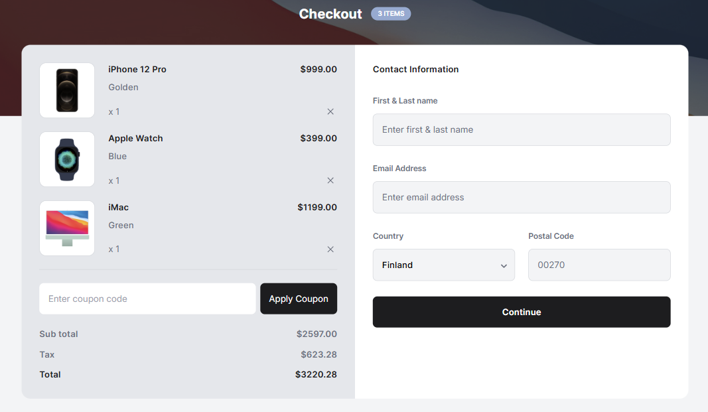

# Device Shop Checkout

Este proyecto es una página de pago diseñada para tiendas de dispositivos electrónicos, con una interfaz moderna y un diseño responsivo que facilita la experiencia de compra. Incluye una presentación clara de los artículos en el carrito, así como un formulario de información de contacto para la finalización de la compra.

## Vista Previa



Puedes ver la versión demo en vivo aquí: [Device Shop Checkout](https://ibrahim-003.github.io/Device-Shop-Checkout/)

## Características

- **Diseño Responsivo:** Utiliza Tailwind CSS para adaptar la página a diferentes dispositivos y tamaños de pantalla.
- **Carrito de Compras:** Presenta una lista de dispositivos en el carrito, cada uno con su imagen, precio y opciones de cantidad.
- **Cálculo Automático:** Muestra un resumen del subtotal, impuesto y total de la compra.
- **Formulario de Contacto:** Incluye un formulario de contacto para recopilar información relevante del comprador, como nombre, correo electrónico, país y código postal.
- **Colores Personalizados:** La paleta de colores cuenta con tonos como `charcoal-black`, `slate-gray`, y `light-gray` para un aspecto elegante y profesional.
- **Imágenes Dinámicas:** Se utiliza la etiqueta `<picture>` para cargar imágenes diferentes según el tamaño de la pantalla.

## Estructura de Archivos

```
|-- index.html                # Página principal
|-- assets/
    |-- images/
    |   |-- ico.svg                     # Icono de la página
    |   |-- background-image.png        # Imagen de fondo del encabezado
    |   |-- Gold.png                    # Imagen del primer dispositivo
    |   |-- Blue.png                    # Imagen del segundo dispositivo
    |   |-- iMac=Front 1.png            # Imagen del tercer dispositivo
    |   |-- close-icon.svg              # Icono para eliminar artículos
    |   |-- leftArrow.svg               # Flecha del selector de país
```

## Instalación

1. Clona este repositorio en tu máquina local:
   ```bash
   git clone https://github.com/Ibrahim-003/Device-Shop-Checkout.git
   ```
2. Asegúrate de tener conexión a Internet para cargar las fuentes desde Google Fonts y Tailwind CSS.
3. Abre `index.html` en tu navegador para ver la página.

## Uso

Puedes personalizar el contenido de esta página modificando el archivo `index.html`. Por ejemplo, es posible ajustar los precios, cambiar los artículos del carrito o editar el formulario de contacto según las necesidades del proyecto.

## Tecnologías Utilizadas

- HTML5
- Tailwind CSS
- Google Fonts

## Autor 👨‍💻
Desarrollado por **[Ibrahim Almeyda](https://github.com/Ibrahim-003)**.
